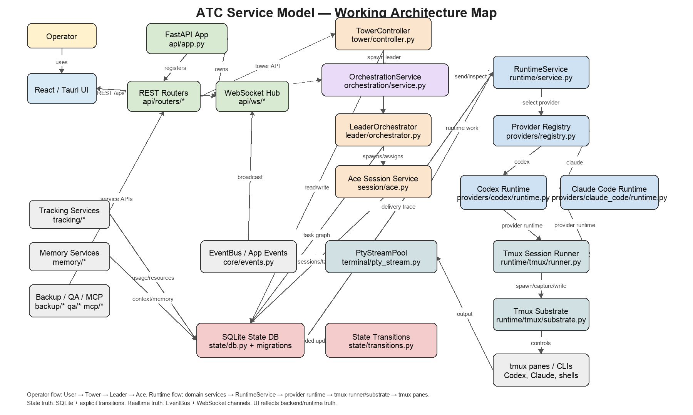

# ATC Service Model

> Quick architecture map for humans and AI agents. Read this when you need a fast understanding of how ATC's services, runtime boundaries, and major classes connect.

## Diagram

The primary diagram is stored as a real image so it can be opened directly from GitHub or downloaded for review.



Source/editable version: [`assets/atc-service-model.svg`](assets/atc-service-model.svg)

## Purpose

ATC is a hierarchical AI orchestration platform with this command path:

```text
Operator / user → Tower → Leader → Ace
```

The codebase is organized around keeping that product hierarchy separate from runtime mechanics:

- **Product/domain logic:** Tower, Leader, Ace, task graphs, lifecycle transitions.
- **Runtime/session logic:** spawning, readiness, prompt delivery, inspection, shutdown, reconciliation.
- **Provider-specific logic:** Codex/Claude readiness, trust/auth/permission prompts, provider CLI behavior.
- **Infrastructure:** FastAPI, WebSocket hub, EventBus, SQLite, tmux, PTY streaming, tracking, memory, backup, QA.

## Main services and packages

| Service / package | Path | Responsibility |
|---|---|---|
| React/Tauri UI | `frontend/src/` | Operator control surface: dashboard, project view, Tower/Leader/Ace consoles, context and usage pages. |
| FastAPI app | `src/atc/api/app.py` | App factory/lifespan, migrations, DB connection, EventBus, WebSocket hub, Tower controller, PTY stream pool, background services. |
| REST routers | `src/atc/api/routers/` | HTTP transport layer for tower, projects, tasks, aces, orchestration, reconcile, settings, usage, memory, backup, QA. |
| WebSocket hub | `src/atc/api/ws/` | Channel-based real-time state and terminal streaming. |
| Tower controller | `src/atc/tower/controller.py` | Singleton top-level orchestrator: accepts goals, starts/stops Tower runtime, spawns or instructs Leaders. |
| Leader orchestrator | `src/atc/leader/orchestrator.py` | Project-level planning: creates task graphs, assigns work, spawns/manages Aces. |
| Ace session service | `src/atc/session/ace.py` | Task-scoped session lifecycle, DB-first creation, runtime delivery, blocked/failed assignment handling. |
| Orchestration service | `src/atc/orchestration/service.py` | Normalized internal control boundary for session operations and future MCP/external control surfaces. |
| Runtime service | `src/atc/runtime/service.py` | Shared spawn/inspect/deliver/stop entrypoint; delegates provider-specific behavior to provider runtimes. |
| Runtime models/tracing | `src/atc/runtime/models.py`, `src/atc/runtime/tracing.py` | Stable delivery result vocabulary and structured trace events. |
| Provider registry | `src/atc/providers/registry.py` | Selects provider runtime implementation by configured/session provider. |
| Codex runtime | `src/atc/providers/codex/runtime.py` | Codex-specific readiness, trust prompt, delivery, and inspection behavior. |
| Claude Code runtime | `src/atc/providers/claude_code/runtime.py` | Claude Code-specific auth/readiness/permission/delivery behavior. |
| Tmux runner | `src/atc/runtime/tmux/runner.py` | Shared tmux-backed session runner used by provider runtimes. |
| Tmux substrate | `src/atc/runtime/tmux/substrate.py` | Low-level tmux commands: sessions, panes, capture, write, resize, kill. |
| PTY stream pool | `src/atc/terminal/pty_stream.py` | Streams tmux pane output through EventBus/WebSocket channels and accepts terminal input/resize. |
| State DB | `src/atc/state/db.py`, `src/atc/state/migrations/` | SQLite/WAL durable state and append-only migrations. |
| State transitions | `src/atc/state/transitions.py` | Explicit task/session lifecycle guards and stable transition errors. |
| Reconciliation | `src/atc/session/reconcile.py` | Compares DB belief against actual runtime/tmux/provider state and performs safe repairs. |
| Tracking | `src/atc/tracking/` | Token usage, token limits, resources, GitHub/CI tracking. |
| Memory | `src/atc/memory/` | Ace STM, project log, long-term memory, consolidation. |
| Backup | `src/atc/backup/` | Local/cloud backup and restore services. |
| QA | `src/atc/qa/` | Autonomous QA/test/fix/retest support. |
| MCP | `src/atc/mcp/` | External control surface intended to call the orchestration boundary, not raw internals. |

## Primary dependency direction

```text
UI
  ↓ REST/WebSocket
FastAPI routers / WebSocket hub
  ↓
Tower / Leader / Ace product services
  ↓
OrchestrationService and RuntimeService
  ↓
Provider runtimes: Codex, Claude Code
  ↓
Shared tmux runner/substrate
  ↓
tmux panes / provider CLIs
```

Durable state and real-time output sit beside that path:

```text
Product/runtime services ↔ SQLite state + guarded transitions
Provider/tmux output → PtyStreamPool → EventBus → WebSocket hub → UI
```

## Core execution flow: goal to Ace work

1. Operator submits a goal or project action in the UI.
2. UI calls a FastAPI route and/or subscribes to WebSocket channels.
3. Tower accepts the high-level goal.
4. Tower delegates project work to a Leader.
5. Leader decomposes work into task graph entries.
6. Leader asks Ace session service to spawn/assign an Ace.
7. Ace session service creates durable DB state before spawning runtime.
8. RuntimeService selects the configured provider runtime.
9. Provider runtime uses the shared tmux runner/substrate to start or inspect the provider CLI pane.
10. Instruction delivery is traced with explicit results: delivered, blocked, failed, no output observed, etc.
11. PTY output streams through EventBus/WebSocket to the UI.
12. Reconciliation checks DB belief against runtime reality and safely repairs known drift.

## Key invariants

- **Command hierarchy:** operator/assistant work should flow `Tower → Leader → Ace`.
- **DB-first creation:** durable session/task records exist before tmux pane spawn side effects.
- **Atomic Enter:** instruction text and Enter are sent without an await gap.
- **Provider-specific behavior lives at the provider boundary:** Codex/Claude prompts, auth, trust, and readiness parsing should not leak into product logic.
- **Tmux is substrate, not product model:** Tower/Leader/Ace logic should not depend on raw tmux behavior except through runtime/provider abstractions.
- **Explicit transitions:** task/session status updates go through transition guards.
- **Delivery truth is explicit:** `sent` is not enough; ATC distinguishes written, delivered, blocked, failed, and observed/no-output states.
- **UI reflects backend truth:** React components should not invent hidden orchestration state.
- **Reconciliation is honest:** unknown runtime truth should produce a finding/escalation, not false success.

## Class-style relationship summary

```text
FastAPI app
  owns EventBus, WsHub, SQLite connection, TowerController, PtyStreamPool

Routers
  call TowerController, OrchestrationService, RuntimeService, DB helpers

TowerController
  delegates to LeaderOrchestrator and uses RuntimeService/DB/EventBus

LeaderOrchestrator
  owns project decomposition and calls Ace session service for task execution

Ace session service
  creates DB session/task bindings and calls RuntimeService for spawn/delivery

OrchestrationService
  normalizes session operations and wraps Tower/runtime flows for stable APIs/MCP

RuntimeService
  selects ProviderRuntime through ProviderRegistry and emits RuntimeDeliveryResult/trace events

CodexRuntime / ClaudeCodeRuntime
  implement provider-specific inspect/deliver/interruption behavior

TmuxSessionRunner
  provides shared tmux-backed spawn/inspect/write/capture primitives

TmuxSubstrate
  runs low-level tmux operations

PtyStreamPool
  bridges tmux pane output/input/resize with EventBus and WebSocket channels

State DB + transitions
  persist source-of-truth records and enforce allowed lifecycle moves
```

## Related docs

- [`docs/ARCHITECTURE.md`](ARCHITECTURE.md) — broader architecture reference.
- [`docs/CODEBASE_MAP.md`](CODEBASE_MAP.md) — current code organization map.
- [`docs/runtime_orchestration_refactor_phases.md`](runtime_orchestration_refactor_phases.md) — completed runtime/orchestration hardening phase history.
- [`docs/RUNTIME_PROVIDER_GUARDRAILS.md`](RUNTIME_PROVIDER_GUARDRAILS.md) — runtime/provider boundary rules.
- [`docs/agents/README.md`](agents/README.md) — Tower, Leader, Ace role contracts.
